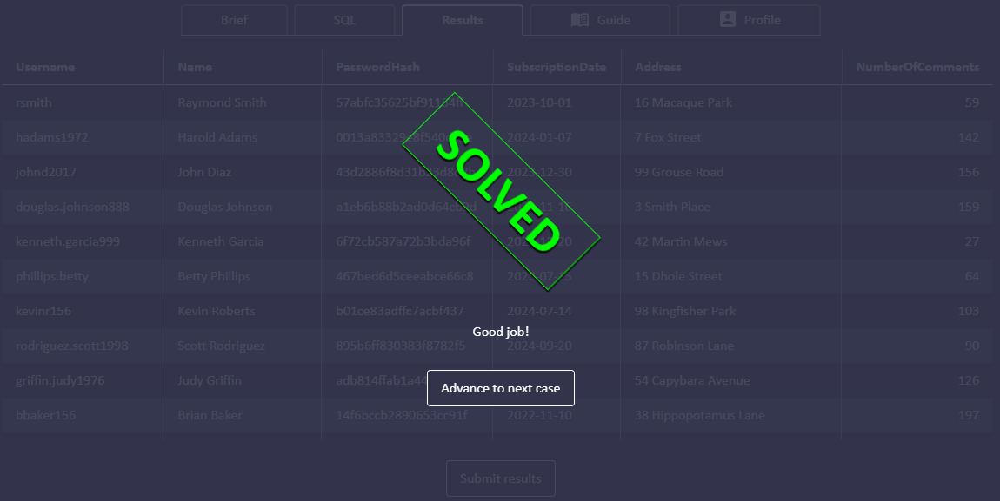
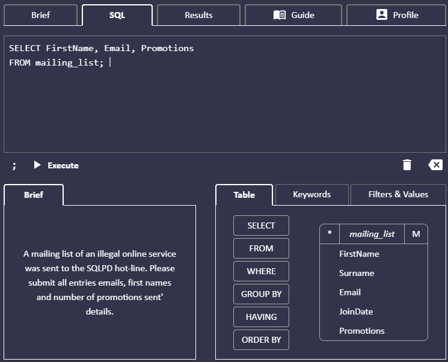
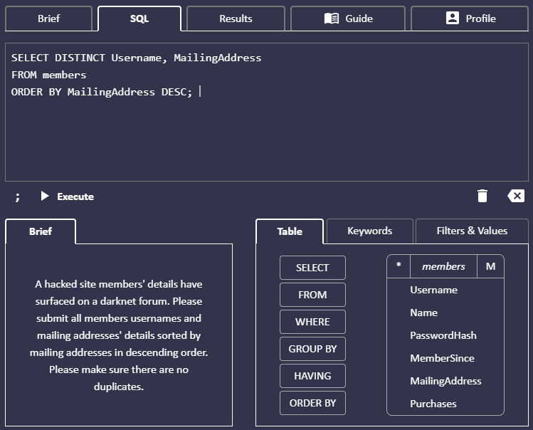

# Taller MYSQL Karen Cristancho

## Ejercicios SQLDP

### 1. **Primer ejercicio**

- Operaciones en SQL
 

- Results

---

### 2. **Segundo ejercicio**

- Operaciones en SQL
 

- Results

---

### 3. **Tercer ejercicio**

- Operaciones en SQL
 

- Results

---

### 4. **Cuarto ejercicio**

- Operaciones en SQL

- Results 

---

### 5. **Quinto ejercicio**

- Operaciones en SQL

- Results 

---

### 6. **Sexto ejercicio**

- Operaciones en SQL

- Results 

---

### 7. **Séptimo ejercicio**

- Operaciones en SQL

- Results 

---

### 8. **Octavo ejercicio**

- Operaciones en SQL

- Results

---

### 9. **Noveno ejercicio**

- Operaciones en SQL

- Results

---

### 10. **Décimo ejercicio**

- Operaciones en SQL

- Results

---

### 11. **Undécimo ejercicio**

- Operaciones en SQL

- Results

---

### 12. **Duodécimo ejercicio**

- Operaciones en SQL

- Results

---

### 13. **Decimotercer ejercicio**

- Operaciones en SQL

- Results

---

### 14. **Decimocuarto ejercicio**

- Operaciones en SQL

- Results

---

### 15. **Decimoquinto ejercicio**

- Operaciones en SQL

- Results

---

### 16. **Decimosexto ejercicio**

- Operaciones en SQL

- Results

---

### 17. **Decimoséptimo ejercicio**

- Operaciones en SQL

- Results

---

### 18. **Decimooctavo ejercicio**

- Operaciones en SQL

- Results

---

### 19. **Decimonoveno ejercicio**

- Operaciones en SQL

- Results

---

### 20. **Vigésimo ejercicio**

- Operaciones en SQL

- Results

---

### 21. **Veintiún ejercicio**

- Operaciones en SQL

- Results

---
